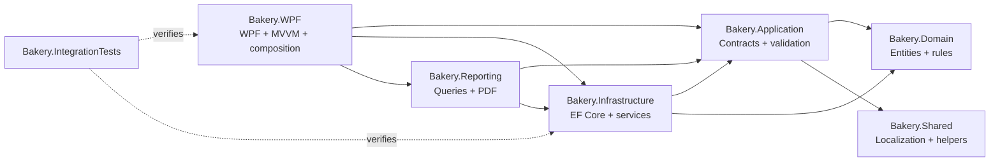

<p align="center">
  
</p>

<h1 align="center">Bakery ERP</h1>

<p align="center">
  <strong>An Arabic-first Windows ERP for bakery operations, finance, stock, production, and daily control.</strong>
</p>

<p align="center">
  
  
  
  
  
</p>

Bakery ERP is a branch-aware desktop application that connects the daily work of a bakery in one SQL Server-backed system. Sales, purchases, stock, recipes, production, waste, treasury movements, party balances, employee settlements, reports, audit history, and backups operate against the same business-day model.

The application is designed for an Arabic right-to-left workflow and can perform its core operations without an internet connection. Google Drive is an optional destination for encrypted backup copies.

## ✨ Main business features

- Sales and purchase invoices with draft, posting, cancellation, cash, credit, and mixed-payment flows.
- Customer, supplier, employee, and mixed-party accounts with balances, statements, payments, and reversals.
- Items, barcodes, units, per-item conversions, stock movements, adjustments, counts, low-stock alerts, and valuation.
- Recipes, production orders, raw-material consumption, finished-goods output, employee production wages, and waste tracking.
- Main, private, daily, and custom safes with deposits, withdrawals, transfers, manual transactions, and resource-level access rules.
- Employee and job-role management with monthly, daily, production, and piecework compensation plus advances, bonuses, deductions, and settlements.
- Multi-branch user assignments, branch switching, branch-scoped data, settings, and system-safe provisioning.
- Working Day opening, close-readiness checks, financial snapshots, cash carry-over, successor-day creation, and guarded reopening.
- Permission-aware dashboards, PDF reports, UTF-8 CSV export, A4 printing, and thermal invoice receipts.
- Searchable audit history, encrypted local backups, safety snapshots, validated restore, retention, and optional Google Drive upload.

## Core modules

| Module | Verified capabilities |
|---|---|
| Sales and purchases | Draft, post, cancel, delete-draft, print, business-date numbering, and cash/credit/mixed settlement |
| Operational accounting | Party records, receivable/payable ledgers, balances, statements, receipts/payments, and payment reversal |
| Treasury | System and custom safes, selected-safe workspace, ledgers, balance controls, transfers, manual cash operations, attachments, and reversals |
| Inventory | Items, barcodes, item types, units, conversions, movement history, adjustments, stock counts, availability, low-stock reporting, and cost controls |
| Production and waste | Recipes, costing, consumed/produced lines, employee contributions, wage entries, controlled cancellation, and stock-linked waste |
| HR and settlements | Employees, job roles, compensation settings, wage history, employee transactions, statements, advances, bonuses, deductions, and safe-linked payments |
| Working Day | Open-day enforcement, blockers, close snapshots, carry-over, transfer to the main safe, next-day creation, reopen eligibility, and blocker resolution |
| Branches and security | Branch administration, user assignments, built-in/custom roles, direct permissions, Super Administrator access, and safe-level permissions |
| Reporting and audit | Sales, production, inventory, account, statement, and treasury views; PDF/CSV output; filtered audit search and CSV export |
| Backup and recovery | Authenticated encrypted archives, automatic close-day backup, validation, five-backup retention, restore safeguards, and optional cloud copy |

## 🏗️ Architecture

The solution uses **Clean Architecture-inspired layering**. `Bakery.Domain` has no package or project dependencies; `Bakery.Application` owns contracts, DTOs, validation, and security policy; and `Bakery.Infrastructure` implements persistence and business services. `Bakery.WPF` is the composition root and uses MVVM through CommunityToolkit.Mvvm view models, observable state, and relay commands.

The result is a pragmatic Clean Architecture-inspired layered design suited to a desktop ERP. `Bakery.Reporting` currently integrates directly with `Bakery.Infrastructure` for reporting queries; moving those queries behind application-owned query contracts is a planned architectural improvement. The diagram reflects the current project references.



### Reliability and data integrity

| Mechanism | Verified implementation |
|---|---|
| Transactions | Explicit EF Core transactions protect invoice posting/cancellation, party payments, treasury operations, stock counts/adjustments, production posting/cancellation, settlements, Working Day transitions, branch/security changes, and system reset. |
| Validation | FluentValidation covers authentication and business requests; services add stock, balance, lifecycle, permission, and duplicate checks; SQL constraints and filtered unique indexes protect persisted invariants. |
| Concurrency | SQL Server `rowversion` tokens, unique open-day constraints, and `sp_getapplock` locks protect stock mutations, document-number allocation, and first-run administrator creation. Item locks are acquired in a stable order. |
| Idempotency | Safe transfers, manual cash operations, and party payments accept idempotency keys. A filtered unique index scopes keys by branch, and services compare a repeated request with the original payload. |
| Traceable reversal | Posted financial, stock, wage, and close-day history is reversed with compensating records and links instead of silently deleting the original entry. |
| Isolation | EF Core global query filters restrict `IBranchScoped` data to the active branch and exclude soft-deleted records. Non-Super Administrators receive default-deny safe access unless a matching permission record exists. |
| Backup safety | Backups use an authenticated encrypted envelope, SQL Server checksum backups, archive validation, `RESTORE VERIFYONLY ... WITH CHECKSUM`, pre-migration/pre-restore snapshots, and rollback-aware restore. |

## Important workflows

1. **First run and sign-in** — startup validates configuration, applies migrations, seeds the main branch, permissions, roles, settings, and system safes, then requires creation of the first Super Administrator when no user exists. A user signs in to an assigned active branch and establishes the active branch and safe contexts.
2. **Invoice posting** — a sales or purchase draft is validated, attached to the active Working Day, assigned a branch/business-date number, and posted transactionally. Posting creates the corresponding inventory, party-ledger, and safe movements; cancellation appends compensating entries.
3. **Production posting** — a production order validates and locks required stock, records raw-material consumption and finished-goods output, creates eligible employee wage/ledger entries, and completes in one transaction. Cancellation checks reversal stock and records linked reversals.
4. **End of day** — closing checks incomplete stock counts, draft/in-progress production, draft invoices, unbalanced safe transfers, negative daily-safe balance, expected-cash mismatch, and closing allocation. An authorized override requires a dedicated permission and a reason.
5. **Close, carry forward, and recover** — the close transaction stores financial/operational snapshots, transfers the selected amount to the main safe, carries the remainder forward, and can open the successor day. Only after commit is an automatic encrypted backup queued. Reopening is permission-controlled and rejects unsafe successor activity unless a supported resolution workflow reverses it.

## 🔐 Authentication, roles, and permissions

- Passwords are hashed with PBKDF2-HMAC-SHA-256 using a random 16-byte salt, a 32-byte key, and 100,000 iterations; verification uses fixed-time comparison.
- The creation/reset policy requires at least 12 characters. Five failed sign-in attempts produce a 15-minute lockout, and login failures use a generic error message.
- The first-run administrator is created inside a serializable transaction guarded by a SQL application lock. No universal production username or password is hard-coded.
- The permission catalog covers sales, purchases, products, inventory, production, treasury, accounting, employees, reports, Working Days, settings, users, roles, audit, branches, and backup operations.
- Effective authorization combines direct user permissions and role permissions. Seeded roles are System Administrator, Branch Manager, Treasury Clerk, Inventory Controller, and Auditor; custom roles are supported.
- Service-layer checks form the authorization boundary. WPF navigation and controls also hide unavailable actions for usability.
- Safe access is controlled independently for access, balance visibility, ledger visibility, cash-in, cash-out, transfer source, and transfer destination.
- Audit records capture stable action keys, branch, user, entity, old/new values, machine, IP when available, and UTC occurrence time. Audit search and export require dedicated permissions.

## Arabic RTL desktop experience

The WPF project targets `ar-EG`, sets the process culture to Arabic at startup, and uses right-to-left layouts across the shell, authentication, dashboard, accounting, inventory, production, treasury, HR, settings, reports, and dialogs. Reports and WPF print documents also render right-to-left, while numeric fields selectively use left-to-right flow where needed.

## Technology stack

| Area | Technology |
|---|---|
| Runtime targets | .NET 8 (`net8.0` and `net8.0-windows`) |
| Repository SDK policy | .NET SDK 9.0.305, rolling forward to later .NET 9 feature bands |
| Desktop UI | WPF, CommunityToolkit.Mvvm 8.4.2, MaterialDesignThemes 5.2.1 |
| Charts | LiveChartsCore.SkiaSharpView.WPF 2.0.5, SkiaSharp 3.119.4 |
| Data access | Entity Framework Core 8.0.29 with SQL Server |
| Validation | FluentValidation 11.11.0 |
| Hosting and DI | Microsoft.Extensions.Hosting and Microsoft.Extensions.DependencyInjection |
| Logging | Serilog with redacted structured file logging |
| Reporting | QuestPDF 2026.7.1, WPF printing, thermal text rendering, UTF-8 CSV export |
| Backup security | AES-256-CBC, HMAC-SHA-256, PBKDF2-HMAC-SHA-256, Windows DPAPI |
| Tests | xUnit 2.9.3, FluentAssertions 8.9.0, coverlet.collector 6.0.4 |
| Packaging | Self-contained `win-x64` publish and Inno Setup |

## Project structure

| Project | Responsibility |
|---|---|
| `Bakery.Domain` | Dependency-free entities, enums, branch-scoping contracts, soft-delete metadata, and concurrency state |
| `Bakery.Application` | DTOs, service contracts, validators, permission/password policies, printing contracts, and application-level errors |
| `Bakery.Infrastructure` | EF Core context and migrations, repositories, SQL Server locking, business services, security, audit, backup/recovery, and seeding |
| `Bakery.Reporting` | Accounting/inventory report queries, reusable QuestPDF components, and PDF generation |
| `Bakery.Shared` | Arabic localization, audit action localization, shared constants, date helpers, and sensitive-data redaction |
| `Bakery.WPF` | Windows UI, MVVM view models, navigation, authorization helpers, charts, dialogs, printing/export, logging, configuration, and startup composition |
| `Bakery.IntegrationTests` | LocalDB-backed integration tests plus security, WPF/MVVM, startup, installer, rendering, concurrency, and end-to-end tests |

## 🧪 Testing

`Bakery.IntegrationTests` uses xUnit. Its shared database fixture creates an isolated SQL Server LocalDB database, applies the real EF Core migrations, seeds controlled data, and deletes the database after the fixture completes. Cloud, connectivity, backup-queue, and restore-failure dependencies are controlled test implementations.

Test categories cover:

- sales, purchases, party accounting, statements, invoice numbering, business-date reporting, and financial idempotency;
- inventory integrity, unit conversion, stock counts, concurrent mutation, production, and waste-related behavior;
- treasury selection, safe permissions, manual cash, Working Day close/reopen, blockers, rollback, and concurrency;
- authentication, first-run setup, user/role authorization, branch sessions, navigation, safe-level access, and security hardening;
- backup encryption/validation/retention/restore, integrity checks, system reset, paths, startup configuration, logging, installer contracts, PDF/chart rendering, and thermal receipts.

Run the complete suite:

```powershell
dotnet test .\Bakery.IntegrationTests\Bakery.IntegrationTests.csproj -c Release
```

> [!NOTE]
> Latest verified local baseline: the Release solution build completed with **0 warnings and 0 errors**, and **all 273 tests passed** in a single solution-level run with no failures or skips. No CI badge is shown because the repository does not currently contain a verified CI workflow.

## 🚀 Getting started

### Prerequisites

| Requirement | Exact repository requirement |
|---|---|
| Operating system | Windows 10 or Windows 11, 64-bit |
| Source control | Git |
| SDK | .NET SDK 9.0.305, or a later installed .NET 9 feature band permitted by [`global.json`](global.json) |
| Framework-dependent run | .NET 8 Windows Desktop Runtime |
| Database | Microsoft SQL Server Express LocalDB x64, version 2019 or newer, with `(localdb)\MSSQLLocalDB` |
| Optional IDE | Visual Studio 2022 with the **.NET desktop development** workload |
| Installer build only | Inno Setup 6 |

A self-contained `win-x64` publish includes the .NET runtime, but LocalDB is still required on the target computer.

### 1. Clone

```powershell
git clone https://github.com/Ahmed15109/bakery-erp.git
cd bakery-erp
```

### 2. Restore and build

```powershell
dotnet restore .\BakeryERP.sln
dotnet build .\BakeryERP.sln -c Release
```

### 3. Configure

The application loads configuration in this order, with later sources overriding earlier ones:

1. [`Bakery.WPF/appsettings.defaults.json`](Bakery.WPF/appsettings.defaults.json)
2. `%LOCALAPPDATA%\BakeryERP\appsettings.user.json`
3. environment variables
4. command-line arguments

The tracked defaults already configure the supported LocalDB instance through Windows integrated authentication. To override them for one Windows user, create or edit `%LOCALAPPDATA%\BakeryERP\appsettings.user.json`:

```json
{
  "ConnectionStrings": {
    "BakeryDatabase": "Server=(localdb)\\MSSQLLocalDB;Database=BakeryERP;Trusted_Connection=True;MultipleActiveResultSets=true;TrustServerCertificate=True"
  },
  "GoogleDrive": {
    "ClientId": "",
    "ClientSecret": ""
  }
}
```

Leave both Google Drive values empty when cloud backup is not used. Never commit real OAuth credentials, tokens, customer connection strings, or per-user configuration.

For environment-variable overrides, .NET uses double underscores for nested keys, for example `ConnectionStrings__BakeryDatabase` and `GoogleDrive__ClientId`.

### 4. Initialize the database

No SQL initialization script is required. On startup, the application:

1. validates the effective configuration;
2. creates or connects to the configured database;
3. creates a safety snapshot before migrating an existing database;
4. applies pending EF Core migrations;
5. seeds the main branch, permissions, built-in roles, branch settings, and system safes;
6. runs an integrity check and opens first-run administrator setup when required.

### 5. Test

```powershell
dotnet test .\Bakery.IntegrationTests\Bakery.IntegrationTests.csproj -c Release
```

The suite is integration-heavy and requires LocalDB. The current local result is recorded in the Testing section above.

### 6. Run

```powershell
dotnet run --project .\Bakery.WPF\Bakery.WPF.csproj -c Debug
```

To create the self-contained release payload used by the installer:

```powershell
dotnet publish .\Bakery.WPF\Bakery.WPF.csproj `
  -c Release `
  -r win-x64 `
  --self-contained true `
  -p:PublishSingleFile=true `
  -o .\publish
```

## 📚 Documentation

| Document | Scope |
|---|---|
| [Documentation index](docs/README.md) | Current operator and developer guidance |
| [Deployment guide](docs/developer/DEPLOYMENT_GUIDE.md) | Windows, LocalDB, publishing, configuration, upgrade, and first-launch guidance |
| [Backup encryption format](docs/developer/BACKUP_ENCRYPTION_FORMAT.md) | `.berpbackup` v1 envelope, key modes, cryptography, and compatibility policy |
| [Dependency decision](docs/developer/DEPENDENCY_DECISION.md) | LiveCharts, SkiaSharp, OpenTK, warning scope, and SDK policy |

Additional operational and technical guidance is available through the [documentation index](docs/README.md); the root README intentionally focuses on the product, architecture, and developer entry points.

## Roadmap

The following items are **planned improvements**, not implemented features:

- Add a LocalDB-capable GitHub Actions workflow before publishing any build-status badge.
- Add Authenticode signing and automated, checksum-published installer releases.
- Move reporting data access behind application-owned query contracts to remove the direct reporting-to-infrastructure dependency.
- Expand clean-machine, physical printer, restore-drill, and live Google Drive acceptance testing.
- Add an explicit license and repository governance files, including contribution and security-reporting policies.

## Contributing

A repository-level `CONTRIBUTING.md` is not present yet. Until a formal policy is added:

1. open an issue before a large feature, schema, or architecture change;
2. create a focused branch and keep domain, application, infrastructure, reporting, and WPF responsibilities separated;
3. add or update tests for business rules, permissions, branch isolation, concurrency, and rollback behavior;
4. run the Release build and the relevant LocalDB integration tests;
5. submit a pull request that explains business impact, migration impact, and verification performed.

Do not commit databases, backups, logs, build output, per-user configuration, OAuth credentials, tokens, or customer data.

## License

This repository does not currently include a `LICENSE` file. The source should not be assumed to grant permission for redistribution, modification, or commercial use. Contact the author before reuse.

## Author

**Ahmed Abdelmonem** — [GitHub @Ahmed15109](https://github.com/Ahmed15109)
